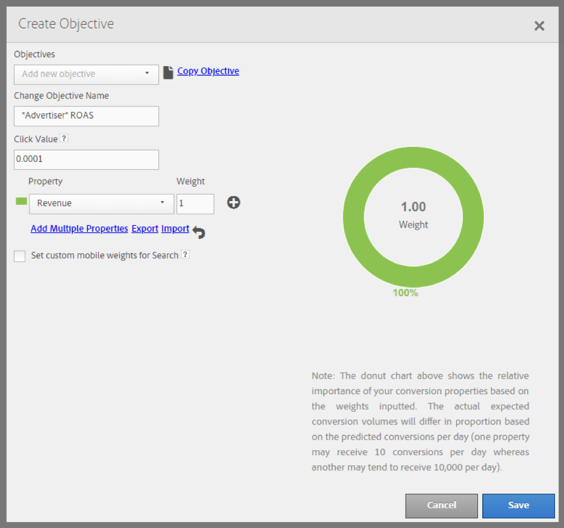
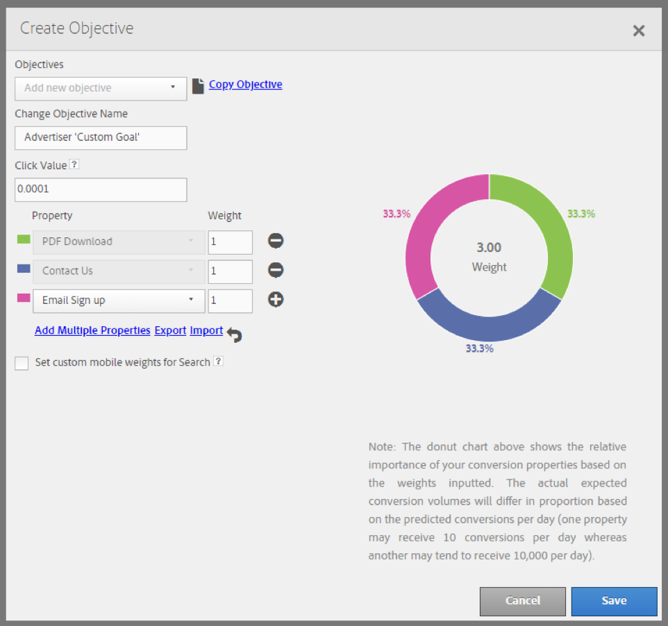
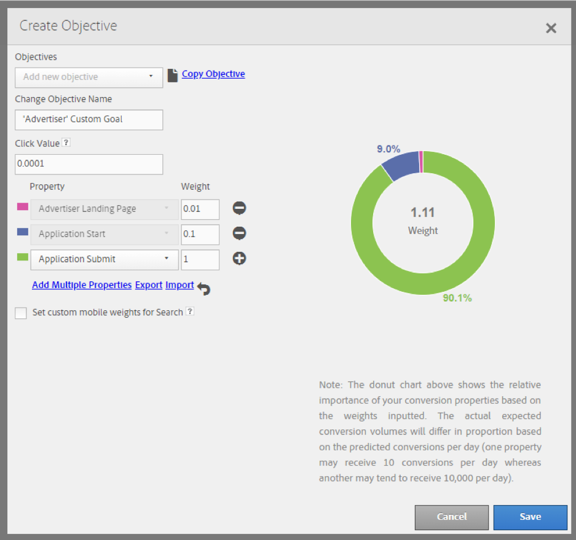

# Building a Custom Goal {#building-a-custom-goal}

## Defining your goal

It is important to understand the goal of the campaign, whether it is Cost per Acquisition (CPA) or Return on Ad Spend (ROAS),as well asthe event(s)on your site which are included in the package’soverall goal.An example of a success event is anOrderConfirmation pageorApplicationComplete page, but canalso bea `specific onsite actionsuch as aPDF Download,Email Sign up,etc.
Ad Cloud can optimize and report towards a single or multiple success events through our Custom Goal tool. Once the Custom Goal is created, you can assign it to your campaign's package for Adobe Sensei algorithmic optimization and reporting.

## In-Platform Set up

`Custom Goals can be built using the Ad Cloud conversion pixel or Adobe Analytics Standard or Custom Events.
`Note:eVarsand Analytics segments are not available for Ad Cloud optimization. Please work with your Account Management team to push Adobe Analytics Standard or Custom Events to the Transaction Property table. All Adobe Analytics Events follow this naming convention:custom_event_(event#)_(analytics report suite ID). Example: custom_event_16_1234567
`Once the Event(s) appear in the Transaction Property table, add a ‘Display Name’ to finalize the mapping process.` * `If you do not include a Display Name, there will be a green check under the ‘Exclude from Report’ field and that Property will not be available when building the Custom`* * `Goal`* * `.`* ``

### Not Mapped

  
### Mapped

  
`Note: The given Display Name is how the Events will appear when making the Custom Goal and how the fields will appear in Ad Cloud Custom Reporting

`When all Transaction Properties are given a Display Name (mapped), navigate to the Objective section and follow the below instructions for Single Property or Multiple Property best practices.`

>[!NOTE]
>For optimized performance, a Custom Goal needs to generate at least 10 conversions per day. For scenarios where the ‘successevent‘ doesnot meet the 10 conversions per day threshold, it is recommended to add supporting event(s) to your Custom Goal, such a product pages or application starts. 10 supporting events can help a package meet the 10/day threshold even with a Weight below 1.
>
> See In-Platform Set up (Multiple Properties) for more information`* ``

### In-Platform Set up (Single Property)

If your campaign goal is Revenue (ROAS), your Custom Goal will look as follows. The ‘Revenue’ Property is selected and assigned a Weight of 1.

>[!NOTE]
>A Property Weight of 1 equates to a value of 1 for each $1 of revenue in Ad Cloud reporting.
* For example, a $250 conversion will report as $250 in Ad Cloud reporting. If assigned a 0.5 Weight, the $250 conversion will report as $125 in Ad Cloud reporting.
* $250 Conversion * 0.5 Property Weight = $125 in Ad Cloud reporting
If your campaign goal is Cost per Acquisition (CPA) and there is only one success event, your Custom Goal will look as follows. In this example, Application Submit is the success event.

Note: With a Property Weight of 1, Ad Cloud will report a value of 1 for each conversion.It is a best practice to set your Weight at 1.
* For example, if there are 10 Application Submit conversions, there will be 10 Application Submit conversions in Ad Cloud reporting. If you have a Weight other than 1, multiply that Weight by the amount of conversions to get the Weighted conversion amount.
* 10 Conversions * 0.5 Property Weight = 5 Conversions in Ad Cloud reporting

In-Platform Set up (Multiple Properties)

There are two scenarios in whichyouwould use multiple Properties in a Custom Goal:

1. Your campaign goal has multiple success events. For example, you’re advertising for more than one onsite action, and all are being attributed to your Cost per Acquisition (CPA) goal. The example objective below has three separate Properties selected (PDF Download,Contact Us, andEmail Sign up), all with a Weight of 1. This is telling the Adobe Sensei algorithm that allPropertieshave equal importance.If you havePropertiesthat have varying costs or importance, you can adjust your Weights accordingly.

   

1. Your Single Property Custom Goal is not getting the minimum of 10 conversions per day. Adding additional supporting Properties to the Custom Goal can help achieve this threshold. Custom Goals that do not meet the 10 conversions per day can be due to minimal daily package spend, or there can be a limited amount of natural conversions.

>[!NOTE]
>When adding supporting Properties to a Custom Goal, they should be Weighted relative to the main success event.

* For example, the below Custom Goal has three Properties, all with different Weights: Application Submit = 1, Application Start = 0.1, Advertiser Landing Page = 0.01. This is saying that for every 1 Application Submit conversion, there are on average 10 Application Start conversions, and 100 Advertiser Landing Page conversions.
* It is important to differentiate weights of your Properties as this is how the data is being fed into the Adobe Sensei algorithm. If a Weight of 1 was given for each of the three Properties, it is telling the Adobe Sensei algorithm that each Property is of equal importance. 

  In this example, if you weighted Landing Page visits equally to Application Submits, due to the naturally higher quantity of landing page visits to application submits, it could overwhelm your goal and skew to landing page visits. By weighting your properties according to level of importance AND keeping in mind the quantity of data points, the Adobe Sensei algorithm will balance multiple properties and optimize toward your Goal.

