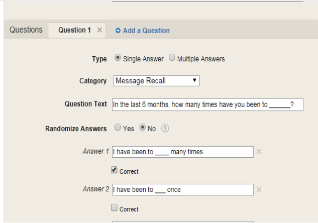
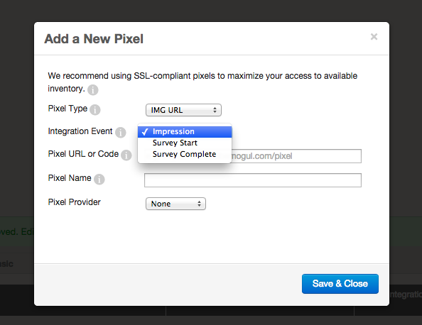

# BrandSights Setup {#brandsights-setup}

   

## Create a Survey

* Click on Surveys on the left navigation bar
* Click on the blue button labelled “New BrandSights Survey”
* For more information on the benefits and capabilities of each Survey ad format, download TubeMogul research [here](https://more.tubemogul.com/brandsights_survey_research_2014).
* You’ll see the survey screen, a form split into two short sections. Here’s how to fill in each field.

### Basic Settings

* Advertiser: Use the dropdown to select the appropriate Advertiser associated with this survey.
* Name: This is the name of your survey.  Because surveys for every campaign in the account will be visible in the same list, consider including the title of the campaign in this field to make it easy to find later.

### Questions

* Type: This field identifies your question as either a “Single Answer”, where respondents can only select one answer with radio buttons, or “Multiple Answers” where respondents can choose multiple options via checkboxes.   Note that there are no open ended or free text response questions; all are multiple choice.
* Category: Select the category from the dropdown menu that best matches the type of survey question you are adding.
* Question text: Copy and paste your question into this field.  You can enter a maxiumum of 257 characters, but because your question will appear in a 300x250 ad unit, shorter character counts will make the question easier to read.
* Randomize Answers: Set this dropdown to “Yes” to display answer choices in random order.   This is only necessary when you are asking respondents to select from a list of options.  For answer choices that are scaled or are in an order that your respondents will probably anticipate (eg Very likely, Somewhat likely, etc), select “No”.
* Answer 1+ text fields: Copy and paste the answer choices for your question in these text fields.  You can have up to six answer choices; click on the “Add an Answer” link to create a new line.
* Answer 1+ drop downs:  Using these drop downs will help ensure that you collect valid data.   Two of them will appear next to every answer line when you select “No” in the “Randomize Answers” dropdown, while all three will appear if you select “Yes”.   Listed from left to right, they are:

    *  Correct(Incorrect): Use this to identify the answer that you most want people to select for the question or that is factually correct.    Questions marked “correct” will be highlighted when you look at the survey results.   Here are a couple of examples of what makes an answer “correct”.

        * In questions with a scale such as Very likely, Somewhat likely, Not sure, etc – “Very Likely” and “Somewhat likely” would probably be favorable and therefore “Correct”.
        * In questions where the advertised brand is one of the answer choices, that option should usually be labelled “correct”.
        * Advanced...: Use this drop down to identify answer choices that either include or exclude all others.   For example, if you have an “All of the above” answer choice in your survey, you would choose the “Selects all” option, so that if a respondent clicks “All of the above”, all of the other answer choices will be automatically selected.   Conversely, if you have a “None of the above” answer choice in your survey, you would choose the “Deselects others” option in the dropdown;  respondents who click “None of the above” would have any other boxes they had checked unselected.  This feature can be used with single- or multi-select questions.
        * Unlocked(Locked): This dropdown only appears when you select “Yes” in the Randomize Answers field.   Use it to lock an answer choice in the same place in the question order when the rest of the options are randomized.   The most common application for this would be when using an answer choice like “All of the above” or “None of the above” which most people expect to appear at the bottom of the list of options.

When you’re done entering your question, click  the large blue “Update Survey” button on the bottom right, or, to enter another question, scroll up to the beginning of the “Questions” section and click on the blue “Add a Question” link.

## Create Custom Segments for Retargeting  to Exposed Viewers and Users Who Already Completed the Survey

* Exposed Viewers:  If you are conducting a Control/Exposed brand lift study, start off by  [creating a retargeting pixel](../../../user-guide/planning/targeting/retargeting/retargeting-pixel-setup.md)and collecting a cookie pool of exposed viewers.  Make sure that once you've created the retargeting pixel, you attach it to the ad and fire it on the "Impressions" integration event.
* Survey Completion Viewers:  [Create a retargeting pixel](../../../user-guide/planning/targeting/retargeting/retargeting-pixel-setup.md)and collect a survey completion cookie pool to avoid having those users served the survey more than one time. Make sure that once you've created the retargeting pixel, you attach it to the survey and fire it on the "survey complete" integration event.

## Create An Ad With The Survey
  
This part of the process is similar to creating an ad using a video already uploaded to the TubeMogul platform.

Here’s what is specific to creating a survey ad.

* Select Ad Unit & Player Screen: Click the blue “Select” button next to 300x250 Survey Standalone.
* Ad Options Screen:

    * Survey tab: Choose a survey from the list
    * Pixel tab: Here you can fire a pixel on survey-specific events  - starts and completes – as well as on the survey impression.   In the placement screen, you can then use one of these options to pixel people who have been exposed to one of these events from seeing the survey again.

## Create a Placement and Attach the Survey
  
The process to creating a survey placement is similar to creating a placement for a video ad.
A couple of important pointers before we begin:

* Create the control placement first – Defining the exposed placement requires you to identify the control associated with it, but creating a control placement doesn’t require anything else to be set up.   You can complete this step later, but starting with the control helps streamline the process.
* If you aren’t running a control/exposed style study identify placements in the “name” field – All survey results will appear in the UI as either “control” or “exposed”, even if you aren’t running that kind of study. In order to keep results organized when you want to analyze the data, we recommend naming one placement “control” and the other “exposed”.

Here’s a step by step summary of what’s different for a survey placement when you’re running an ad effectiveness study using the control/exposed methodology.

<table> 
 <tbody> 
  <tr> 
   <td> 
<strong>Section/Field</strong>
  </td> 
   <td><strong>Control Group</strong></td> 
   <td> 
<strong>Exposed Group</strong>
  </td> 
  </tr> 
  <tr> 
   <td>Survey Settings</td> 
   <td>Click the checkbox next to “This is a control placement”.   Doing this will make the drop down menu below disappear.   When you look at the reporting for this placement, you will not be able to see the data for the exposed group.</td> 
   <td>Skip the checkbox and choose your control placement from the dropdown list.   Once you have done this, reporting for the exposed group will also include data for the associated control placement.</td> 
  </tr> 
  <tr> 
   <td>Targeting</td> 
   <td>For control/exposed ad effectiveness studies, target to the same geos and sites as the campaign.</td> 
   <td>For control/exposed ad effectiveness studies, target to the same geos as the campaign, and check the “all available sites” box.</td> 
  </tr> 
  <tr> 
   <td>Audience</td> 
   <td>For control/exposed ad effectiveness studies, you want to exclude anyone who has viewed the ad, by clicking on the blue “Select Segments” link, then adding that segment to the “None of these segments” box.</td> 
   <td>For control/exposed ad effectiveness studies, you want to serve the survey only to those who have viewed the ad. To do this, click on the blue “Select Segments” link, then add the exposed segment pixel to the “Any of these segments” box.</td> 
  </tr> 
  <tr> 
   <td>Budget and bid</td> 
   <td>If you are running a control/exposed survey, keep in mind that, unless the site list is very restricted, the pool for the control group is often bigger, which means more opportunities to reach potential respondents and shorter lead times to hit response targets in many cases.   In most cases, you will want to collect responses from both groups in the same timeframe, so starting the control with a lower daily budget than the exposed group will slow the fielding time to even the pace of both placements.For US campaigns, the cost per response for the exposed group is about 40% higher than the control group.</td> 
   <td></td> 
  </tr> 
 </tbody> 
</table>

Finally, before setting the placement live, go to Options and attach your ad to the placement.
