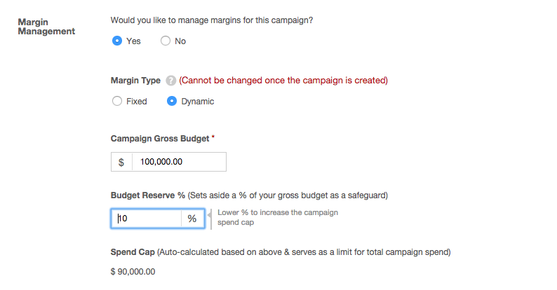
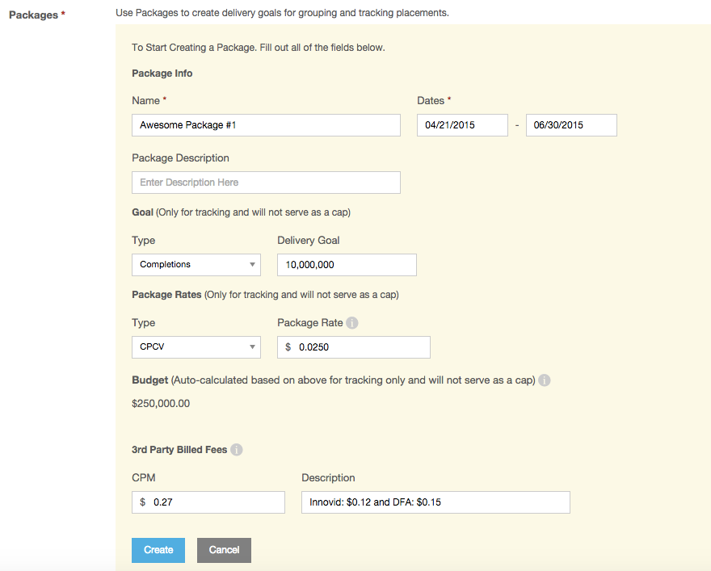
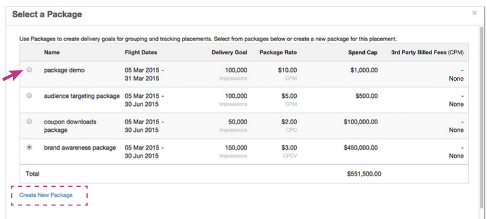
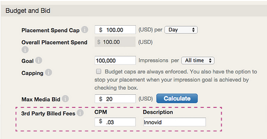
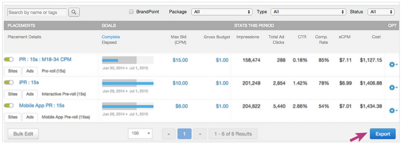

# Dynamic Margin Management {#dynamic-margin-management}

Dynamic Margin Management is the second business model that is supported in TubeMogul's Margin Management feature. This option allows you to manage margins down to the placement level and optimize based on the financial efficiency of each placement. This feature gives you more flexibility than the Fixed Margin Management tool, but unlike that feature does not guarantee the margin %. It is up to the campaign manager to deliver the contracted units at or below their net margin to get the margin they want.
This feature should be used if your client issues you an insertion order, consisting of several line items that you have agreed to deliver a fixed amount of units or unit types at a fixed rate. In the platform the insertion order is represented as a campaign, and line items are represented as [packages](campaign-setup/packages.md). Each package will have a specific goal, rate, and placements assigned to it. The placements can have different strategies and tactics organized to deliver the line item requirements, or in our case the "package goals" and "package rates".

## Feature Setup:

Step 1: Navigate to the Campaigns page on the left hand side, and Create New Campaign. From there, fill out the Basic Campaign Details section.

Step 2: Fill out the Margin Management section of the page:

* Select "Yes" to activate Margin Management and "Dynamic" for the Margin Type
* Enter the Gross or Client's Budget
* Budget Reserve % is an optional safeguard, that can be used if you are not comfortable in putting the entire insertion amount as the spend cap. If during the campaign you are unable to deliver the contracted amount of units, you can make the decision on whether to increase your spend cap by reducing the reserve percentage.&#42;
* Spend Cap will be auto-calculated based on the Gross Budget and Budget Reserve %.

Step 3: Under Packages click Create a New Package. A new form will populate prompting you to fill in the following information:

* Name: Choose a name for your package
* Dates: Flight dates, note that all placements tied to this package must fall within these dates. These dates must also fall within the campaign flight dates.
* Description: Optional, if you'd like an additional description
* Goal Type: Select the metric that is your primary goal
* Delivery Goal: The number you'd like to deliver
* Package Type&#42;: The pricing method for the advertiser. This is used to calculate the dynamic margin but will not cap delivery; you can cap spending only at the campaign level using a fixed margin.
* Package Rate&#42;: The rate for the advertiser. This is used to calculate the dynamic margin but will not cap delivery; you can cap spending only at the campaign level using a fixed margin.
* Budget is then auto-calculated based on the above information, and used for tracking ONLY.
* 3rd Party Billed Fees: Enter a consolidated CPM amount and 3rd party fee description.**Note:** This feature doesn't override fees for optional services, such as Nielsen, comScore, and IAS, are tracked as "non-billable other cost." To bring your own rate for these services, contact your Account Manager.
 

## Feature Setup (Placement Level):

Step 1: Create a package when creating/editing a placement.

Step 2: Either choose a Package that has already been created, or Create a New Package. If you are creating a new package, the same package form as above will populate.

This feature also allows you to set up 3rd Party Billed Fees at the placement level.

>[!NOTE]
>
>Only include these fees if you have not done so at the package level, or if these fees should only be associated with a single placement within the package.

## Reporting:

This is accessible in different parts of the platform, depending on the feature.

Margin Management can be found at the campaign and placement reporting pages, as well as exported at the bottom of each page. Revenue will encompass media cost as well as the margin you've obtained.

[ 

Package level reporting is accessible in 2 ways:

* Option 1: Filter placements by package association in the placement list page.

  [ 
 
* Option 2: Export package level data by hitting "Export" button.

  [ 

In the exported page, analyze the data using the metrics below:

* Package name
* Margin % (if fixed margin or package rates are used)
* Profit
* Revenue (if fixed margin or package rates are used)
* Breakout of costs by TubeMogul billed (billable) vs 3rd Party Billed (non-billable)

  * Billable Media Cost
  * Billable Data Cost
  * Billable Other Cost
  * Non-Billable Media Cost
  * Non-Billable Data Cost
  * Non-Billable Other Cost - 3rd party billed fees will roll up here

>[!MORELIKETHIS]
>
>[Fixed Margin Management](fixedmargin.md)
