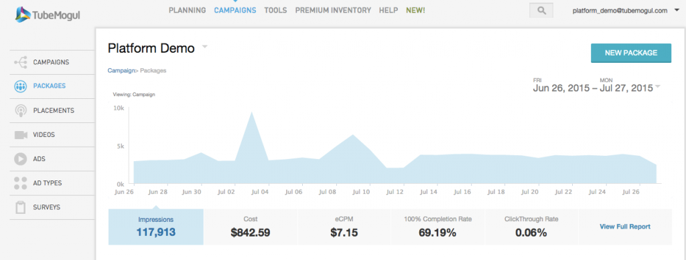
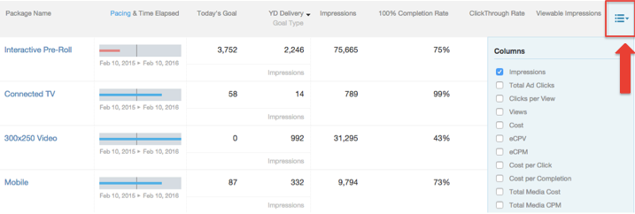
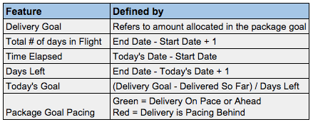
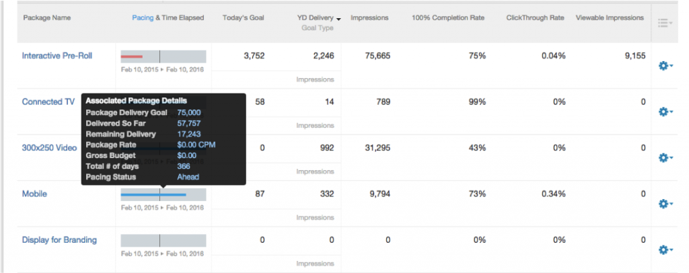
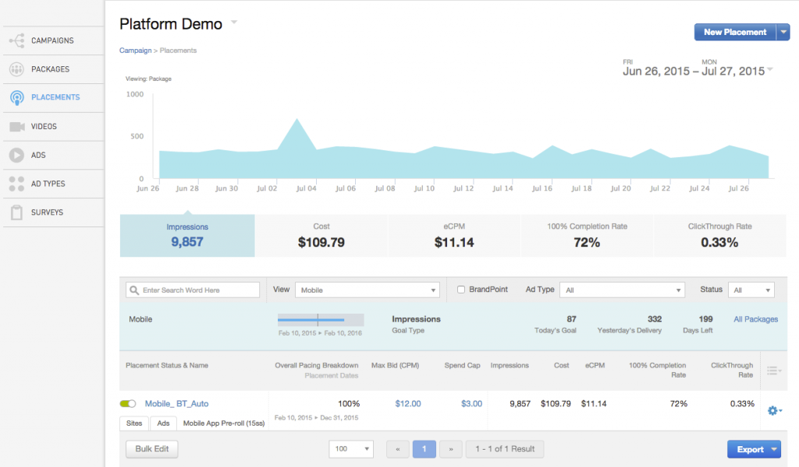

# Packages Dashboard {#packages-dashboard}

The [Packages](campaign-setup/packages.md) Dashboard centralizes performance and economic reporting across all of your package strategies, providing quick snapshots of how your campaigns are performing.

The dashboard includes a high-level overview of your campaign metrics, customizable date ranges, and the ability to create a new package.

It also shows campaign performance by package. Every package has a placement or group of placements that are tied together by a shared delivery goal. In this section you can search across your packages or filter by Goal Type. As the page updates based on your selection, the graph and high level metrics at the top of the page will also update to quickly determine how each package influences your overall campaign strategy.

Package level stats provide you with real time information on pacing, delivery, and performance across each strategy. Package Name, Pacing & Time Elapsed, Today's Goal and Yesterday's (YD) Delivery are constant metrics whereas the other 5 (Impressions, Cost, eCPM, Completion Rate, and ClickThrough Rate) can be changed using the drop down menu on the right.

List of Pacing Metrics:

Another amazing feature of this new dashboard, is the Pacing & Time Elapsed section. The pacing bar will show you how you are performing against your goal. If the bar is red than you are behind, and if it is blue then you are ahead. If you hover over the bar then it'll show you more in-depth details for each package.

And if at any point, you'd like to see all the placements within each package, all you have to do is click on the package and it'll take you back to the placement page with the appropriate package already filtered.

Lastly, like any page in the UI you can use the Export button at the bottom of the page to see your data in Excel.
>[!NOTE]
>
>Reporting is also available via [reports](../../user-guide/measurement/campaign-reporting/email-reports.md).
