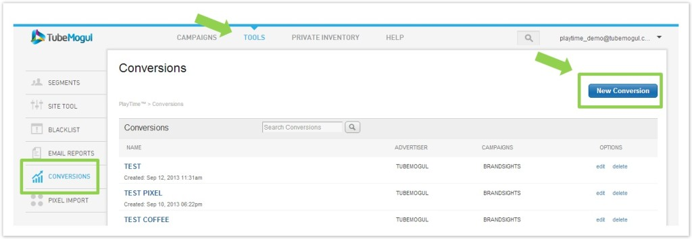
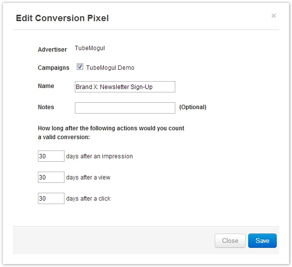
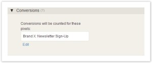

# Conversion Pixel Setup {#conversion-pixel-setup}

**STEP 1:&nbsp;**Create a New Conversion pixel by clicking on the Tools option in the top menu bar. Then click on the Conversions tab on the left hand navigation.

**STEP 2:**&nbsp;Click on New Conversion and the platform will prompt you to choose either a Standard Conversion or Facebook Conversion pixel process. If you're tracking conversions on a Facebook placement, you can set that up [here](facebook-conversion-pixel-setup.md). Otherwise, select Standard and choose the appropriate Advertiser. If you have not created your Advertiser yet, please create it before continuing.

<image>

When a conversion pixel is created, you can select which campaigns it should apply to. This will also have the effect of enabling this pixel by default for any new placements created for this campaign. If the pixel is activated for a campaign after placements have already been created, they will need to have the pixel explicitly activated by editing the placement.

Next you specify how long after a viewer action would you count a valid conversion. For example below you are counting a conversion when someone who has seen your ad or clicked on your ad within the last 30 days, signs up for your brand's newsletter.

**Attribution**

Attribution of the conversion refers to the decision of which ad to associate the conversion to, from a potential set of ads the user was exposed to. The industry norm is to use a "last-touch" attribution. However, there are some precedence rules that come into play as well.
Our current model uses this approach:

1. If there are any click-throughs on any ads enabled for this conversion pixel, they are considered first. The ad most recently clicked-on and still within the lookback window will receive the conversion.
1. If there are any video views on any ads enabled for this conversion pixel, they are considered next. The ad most recently viewed and still within the lookback window will receive the conversion.
1. If there are any inbanner impressions on any ads enabled for this conversion pixel, they are considered last. The impression most recently exposed to and still within the lookback window will receive the conversion.

Note: Only one conversion per-user-per-conversion-pixel is permitted every 24 hours.
**STEP 3**: Copy the HTML Tag and drop it into the website where the conversion takes place. Verify the conversion is firing with a Web Developer Tool like Charles, Firebug or Fiddler.

**STEP 4:&nbsp;**&nbsp;If the conversion pixel is activated for a campaign after placements have already been created, they will need to have the pixel explicitly activated by editing the placement and enabling the conversion tracking in each specific campaign placement:

**Possible Stats Discrepancies**

1. Other ad servers may not limit against the user + conversion pixel. So for sites that have multiple conversion pixels, we will attribute a conversion to the user landing on each one. Other ad servers may limit this more strictly, ie. only allow one conversion per placement or creative.
1. Browser that don't allow 3rd-party cookies will not properly count conversions.
1. Often people may compare click-throughs to conversions. However, these can be quite mismatched, for reasons such as:

* If the click-through doesn't go through directly to the page the conversion pixel is on, ie. it requires more user activity (sign-up, check-out, etc.) before the pixel fires.
* A person can only convert on the same ad once every 24 hours. Often we see multiple clicks by the same user, so these get filtered out.
* Popup blockers that prevent the actual window from opening, even though we've counted the click-through.
* People that surf off the landing page before the conversion pixel fires.

