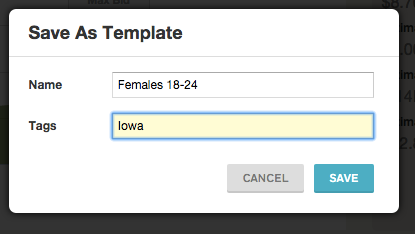
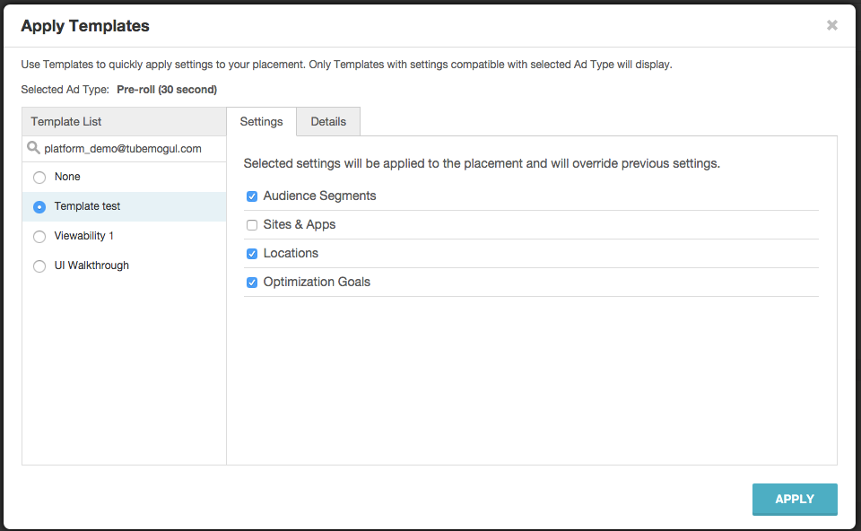
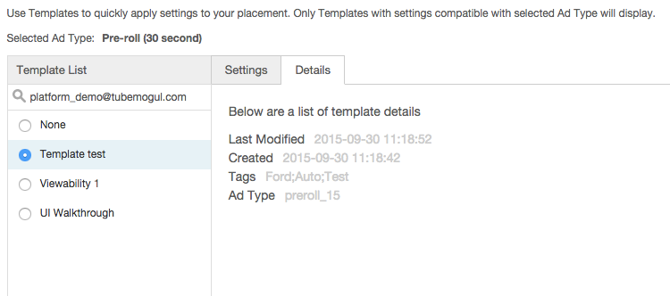
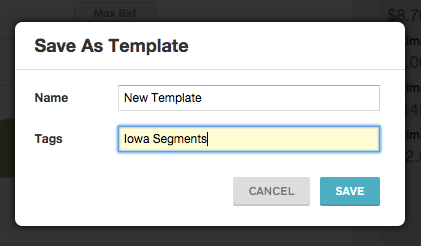

# Templates {#templates}

You can build templates to save a set of targeting parameters to reuse for new or existing placements. You can activate templates across ad types and duration, saving time and simplifying campaign execution.

## Create a Template

To create a Template, select the targeting parameters you're interested in saving and scroll to the bottom of the page to "Save as Template."

Add the appropriate name and click "Save."

## Apply a Template

* Navigate to the Placement Edit page, by either creating a new placement or editing a current one
* Under the Basics section, choose "apply template"

 

* The next window will prompt you to choose from the templates you've already created, choose 1 or all 4 to apply to your placement

* Once you've selected the targeting parameters you'd like to apply to the placement, go ahead and click "Apply"
* If you'd like to see the last time the template was modified, created, or any tags associated to the template, click the "Details" tab

 

* After you've applied the template/s to the placement, you can still go into each section and make changes
* If you'd like to make changes to an existing template or save a new one, just select "Save as Template" at the bottom of the page

 

* The page will prompt you to create a name and add any tags (keywords) that you can use to search for the template at a later date, then all you have to do is click "Save"

 
This feature will be coming out in phases, and as of 10/5 the targeting parameters that are available in templates are:

* Audience Segments
* Site Targeting
* Location Targeting
* Optimization Goals

>[!NOTE]
>
>* You can apply mutiple templates to one placement
>* Conflicting targeting parameters will overwrite with the latest selection
>* Templates are Ad Type agnostic but we filter the targeting parameters based on compatibility to Placement Ad Type you are applying the template to. Incompatible targeting will not be shown.
>* Templates are saved at the account level and so you'll be able to find and use other users' templates within the same account
