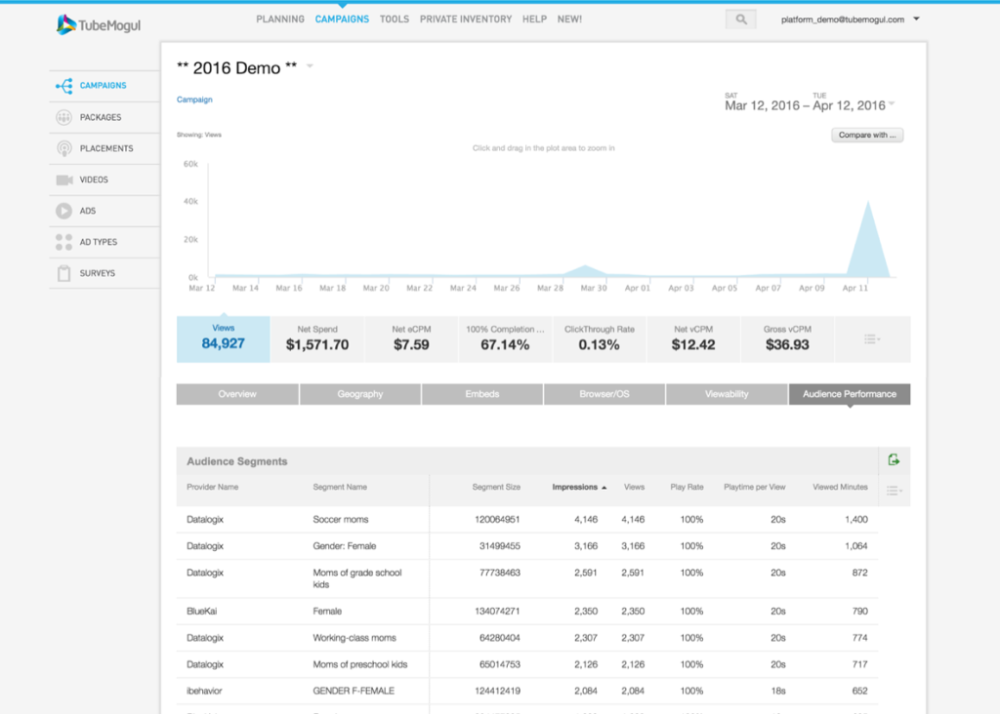
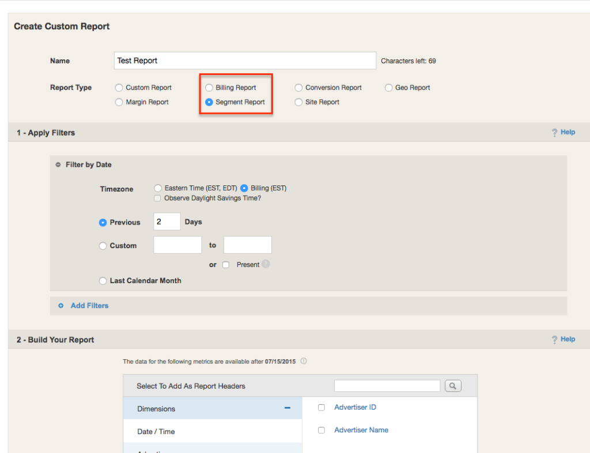

# Segment Reporting {#segment-reporting}

With Advertising Cloud DSP, advertisers can access powerful, performance focused reporting in the format that best suits their needs. Our newest example of this is segment reporting, where advertisers are able to gain insight into audience-level performance of each segment across every campaign and placement within the platform. This real-time data gives brands transparency into the cost and performance of each segment relative to another to better determine the optimal mix for existing and future campaigns.

Reporting is available on the campaign/placement level as well as within Custom Reports. The 'Audience Performance' tab on the campaign/placement pages will display a new Segment Membership value to represent the number of users that fall into a given segment. These values account for segment overlap and will not will match the number of impressions delivered. For example, Suzie is in the market for a new wardrobe. She may fit into three segment groups within a single placement; the intent to purchase shoes, female 18-49, and shopping enthusiast. If Suzie is served an impression, each of these segment groups will be credited with a value, leading to a total of 3 vs the billable amount of 1 impression. Actual delivery is accounted for in billable segment reporting.

To access reporting, from the campaign/placement pages, navigate to the 'Full Report' page and there will be the new 'Audience Performance' tab.

>[!NOTE]
>
>You must attach behavioral segments to the campaign to get reporting.*

To access reporting, from our Email Reports/Custom Reports page, navigate to the report from the Tools section and select either 'Billing or Segment Report' from the templates. The 'Billing Report' will give you audience (segment) level information on the cost of each segment you delivered against, whereas the 'Segment Report' will give you performance metrics against each segment.

