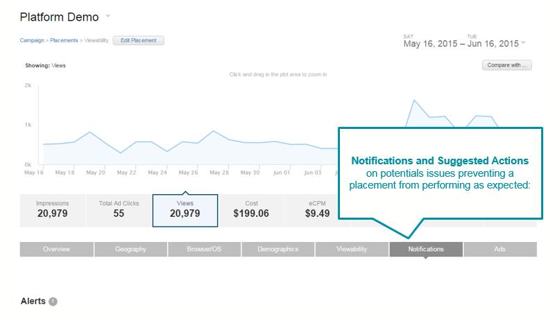
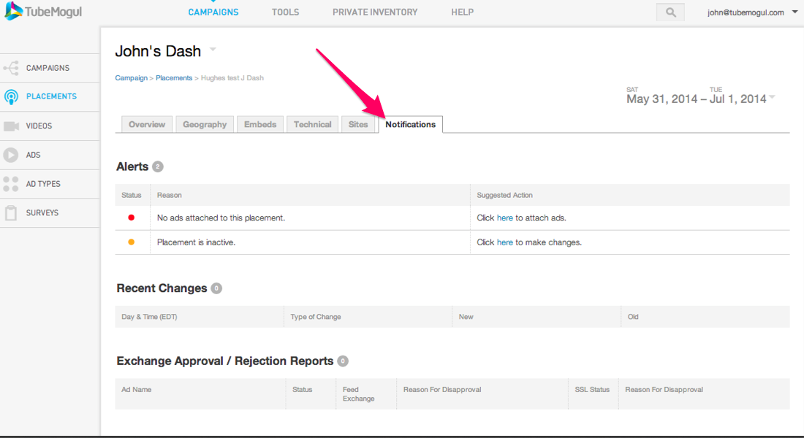
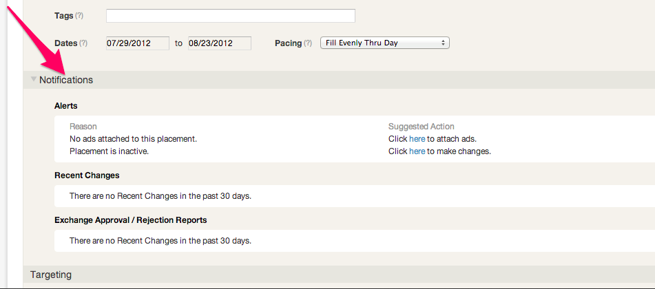

# Notifications {#notifications}

## What is it

A diagnostic tool that provides more visibility into placement problems and offers potential solutions. This tool has 3 main features:

* Alerts and suggested actions. Alerts are categorized red flags or warnings over potential issues that may be blocking/preventing a placement from performing as expected. Note: these are not emailed alerts.

  * RED LEVEL (high)

    * Not enough money in account to support all active placement budgets
    * No ads attached to this placement
    * No active ads for this placement
    * Ad has been admin rejected
    * Placement has a low win rate

  * ORANGE LEVEL (Medium)

    * This placement is active but has surpassed it’s end date
    * Approaching campaign budget cap. You have spent X% of your budget cap
    * Placement is inactive
    * Ad has not been admin approved yet
    * Currently, there are no active ads for placement’s custom flight
    * This placement is ending soon

* Recent changes is as an activity log for account user changes made to the following:

    * Max bid
    * Budget
    * Start Date
    * End date
    * Goals
    * Status
    * Frequency Cap
    * Placement Name

* Exchange approval/rejection will list ad approval/rejection reports from an exchange. (for e.g. if Google AdX rejects an ad)

## Where to find it:

There are two places in the UI where the Notifications will be accessible:

1. From placement reports in a tab called Notifications

   

1. From edit placement page, in a section called Notifications

   

## Why it is useful

Diagnostic tool flag and alerts for potential issues with placements - then suggests remedies. This will enable troubleshooting to be part of your normal workflow of a campaign.

## When to use it

As the first step in troubleshooting placement-wide issues.

## What it currently does not do:

* While the feature can be accessed from any placement report page, it will not be available in the edit placement page for BrandPoint placements
* The first iteration will not track changes for targeting parameters like site lists, geos, audience segments
* Will also not track changes by user
