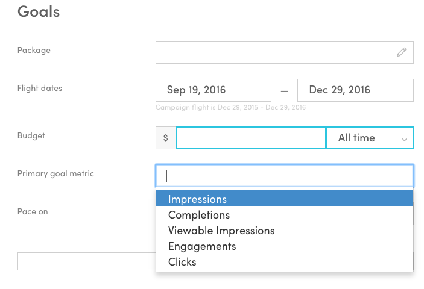
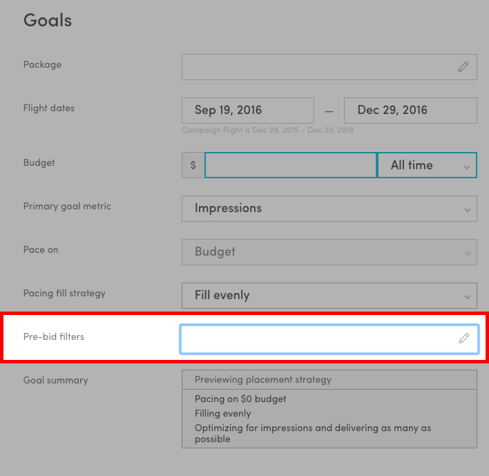
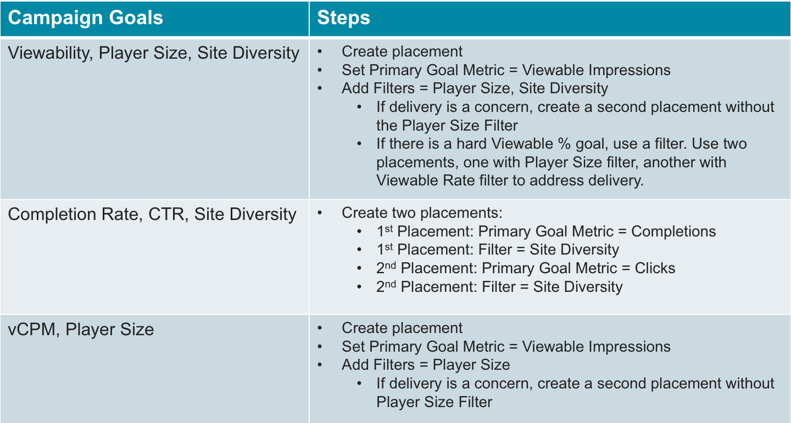

# Optimization Best Practices {#optimization-best-practices}

TubeMogul’s platform automatically adjusts spend to sites where you are delivering the metrics you most care about, to ensure that your dollars are spent efficiently. Our auto-optimization tool is dynamic and adaptive to campaign performance and only focuses on high impact sites that can dramatically increase performance.
  
There are two steps to optimizing your placements under the Goals section of the Placement Editor. The first step is to set a primary goal metric. The primary goal metric you set is the objective you would like to accomplish when serving ads for that placement. For example, selecting “impressions” will optimize bidding to maximize the number of impressions we serve. Choosing “viewable impressions” will optimize bidding to maximize the amount of viewable impressions you’re delivering at the most efficient price. To activate this feature, select your primary goal in the Goals section of your placement editor page.

If there are any crucial goals that should be considered before delivery, set that as a pre-bid filter. Pre-bid filters are additional criteria that must be met to bid on an opportunity. For example, if you need to reach 50% viewability and deliver 10,000 impressions, you can do this in our new section. The pre-bid filters model is found in the same Goals section of the placement editor. To find it click the “See more options” tab. When you see the “Pre-bid filters” label, click on the empty box and a pop-up window will appear.

When adding pre-bid filters, keep in mind that bidding will only occur when the filters are met. This means that each rule added may limit the opportunities that a placement can bid on. If more than one filter is added to a placement, both filters have to be met before delivery is considered. Once a filter is met, the system will optimize towards the delivery goal you’ve set. Since filters can affect scale, we recommend adding no more than 1-2 filters.
Currently available pre-bid filters (more to come soon!):

* 100% Completion Rate
* ClickThrough Rate
* Player Size
* Site Diversity
* Viewability (IAS)
* Viewability (MOAT)
* Viewability (TubeMogul)

&#42;Note these goals are ad unit dependent. For Viewability and Player Size the placement will have to be Interactive Pre-Roll to gain access to these metrics.

`**Considerations**`

In order to help you get the most out of our new algorithm and simplified module, we’ve aggregated a few use-cases and the best way to set up those placements.

Please note that a placement-level primary goal will override the package-level primary goal if they differ. This allows you make multiple placements with different goals and attach them all to one package. 