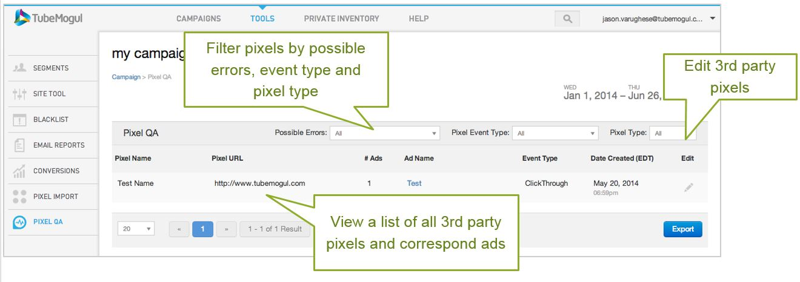

# Pixel QA Tool {#pixel-q-a-tool}

**What is it:**
  
The Pixel QA tool in the Tools menu lists all errors associated with third-party pixels in your ads and allows you to quickly troubleshoot issues. Use the tool whenever you attach a third-party pixel to an ad.

The tool lists all third-party pixel-related errors, and the ads associated with each pixel. For an error with associated ads, you can either open the settings for any associated ad so you can edit the pixel URL as needed, or edit the pixel URL or other pixel settings directly.

You can filter the error list by error type (ads with no pixels, ads without impression pixels, pixels without ads, the same pixel on different events, or the same pixel on different ads). You can also filter the list by pixel event type (such as impression or view) and pixel type (Flash, HTML, or JavaScript).

You can download the entire list to your browser's default download folder as a report in XLSM (macro-enabled Excel spreadsheet) format. For more information about your browser's download procedure, see your browser’s online help.

