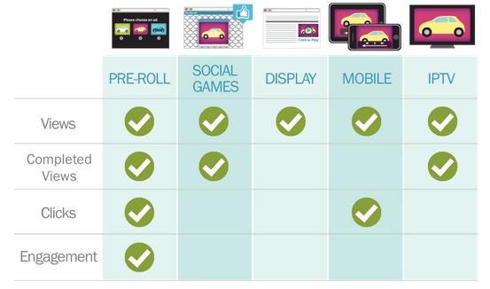

# Performance Pricing {#performance-pricing}

The vast majority of digital advertising is designed solely to drive clicks and impressions. However, video is a branding tool and meant to drive upper funnel metrics such as consumer sentiment, message association and brand lift.  Advertising CLoud DSP operates on CPM, but below are recommended pricing models you can use during your campaign planning stages, to help focus your ad dollars on consumer engagement.

* CPM (Cost per Mille): charged for every 1000 impressions

* CPV (Cost per View): charged only when someone watches part of video ad

* CPCV (Cost per Completed View): charged only when someone watches entire video ad

* CPE (Cost per Engagement):  charged only when someone engages with video ad. For example when the viewer hovers over the interactive banner.

* CPC (Cost per Click): charged only when a someone clicks on video ad  
