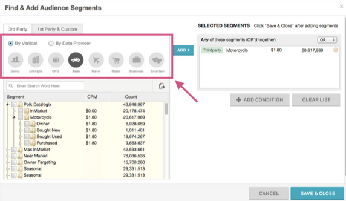
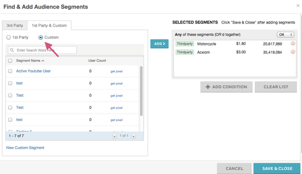

# Behavioral Audience Segment Targets {#behavioral}
 
1. Click on New Placement in the upper right corner of the page.
1. Select the unit you are interested in using.
1. Scroll down the Placement Options page to the Targeting section and under Audience Segments click on Edit Segments.
1. Choose which data segments are relevant to your campaign by either vertical or data provider.

## Custom Segments
This tool also allows you to access to target first-party data segments in two ways:

* You can collect cookies within the platform by [creating a retargeting pixel](retargeting/retargeting-pixel-setup.md) and [retarget](retargeting.md) users.

* You can load your own DMP data into Advertising Cloud DSP with the help of your Account Manager.

{!TIP]
>
>* Behavioral targeting isn't recommended for tightly-targeted campaigns (for example, for audiences within specific DMAs or zipcodes or for dayparting).
>* Segments ideally should include at least 10M users.
>* Using third-party segments incurs an additional data cost. Check the Audience tool for pricing.

