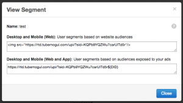

# Retargeting Pixel Setup {#retargeting-pixel-setup}

1.In the main menu, select **DSP > Tools > Segments**.

   

1. Click **New Custom Segment**, enter the segment name, and then click **Save and Close**.

   Use a segment name that clearly states the type of cookie pool you are collecting (such as Homepage Visitors- Site X).
  
1. In the Options column, click the gear icon on the right side and select **get pixel**.

   Use the HTML tag if you are placing it on a website, and use the Flash tag if you are attaching it to an ad.
  
   
  
1. Use a debugging tool such as Charles or Fiddler to verify that the pixel is firing correctly.
  
1. Check the Segments Manager periodically to confirm the segment size increases.
