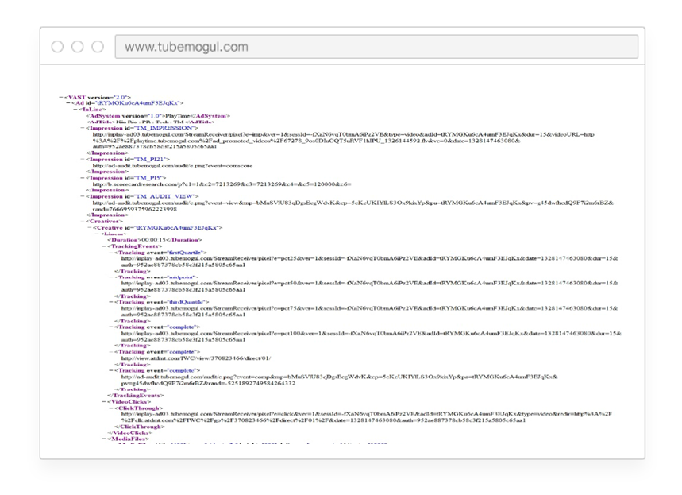
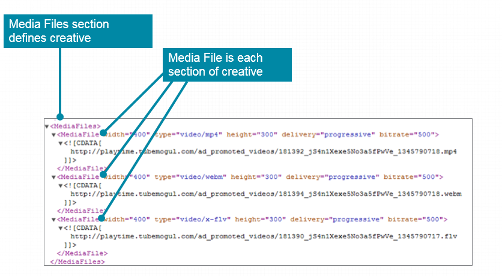

# Ad Tags {#ad-tags}

TubeMogul's platform accepts IAB VAST&nbsp;and VPAID 2.0 tags.

* If using&nbsp; [VAST](http://www.iab.net/guidelines/508676/digitalvideo/vsuite/vast/vast_copy)&nbsp;(Video Ad Serving Template) tags, set up the ad as&nbsp; [Standard Pre-roll](../../../../user-guide/planning/ad-formats/in-stream/standard-pre-roll.md)&nbsp;in the platform. Unless you'd like to track [Viewability](../../../../user-guide/measurement/viewability.md) within our platform, then you should set it up as Interactive Pre-Roll.

* If using&nbsp; [VPAID SWF](http://www.iab.net/vpaid)&nbsp;(Video Player-Ad Interface Definition)&nbsp;tags set up the ad as&nbsp; [Interactive Pre-roll](../../../../user-guide/planning/ad-formats/in-stream/interactive-pre-roll.md)in the platform.

    * Another more recent type of tag delivery that is rapidly growing for Interactive Pre-roll is [VPAID JS](ad-tags/vpaid-js.md).

* If using VAST Wrappers and Redirects&nbsp;contact your Account Manager&nbsp;for testing.
* VAST can also be used for standard mobile pre-roll, whereas [MRAID](http://www.iab.com/guidelines/mobile-rich-media-ad-interface-definitions-mraid/) is necessary for mobile interactive pre-roll

Please rely on the TubeMogul platform for targeting and remove all filters (geo,device,etc.) from your 3rd party ad tag.
**Best Practices:**

* For VAST tags, highly recommended to include all three video formats: &nbsp;FLV, MP4, WebM. &nbsp;If you are running a companion banner, it must also be included in the VAST XML file as <HTMLResource> Or <IFrameResource>.
* For VPAID tags, include creatives, companions and tracking pixels all in the SWF file. Drop the tag on a browser and verify in the XML file that the apiFramework="VPAID".
* If you are running on a&nbsp; [private feed](../../../../user-guide/planning/private-inventory.md), please consult with publishers on format restrictions.
* To maximize your ability to delivery across all inventory, we strongly advise all 3rd party ad servers to be&nbsp; [SSL compliant](http://support.google.com/adxbuyer/bin/answer.py?hl=en&answer=3016708). To ensure that your ad is SSL compliant confirm that all&nbsp;tags start with "https" instead of "http". This includes 1x1 pixels as well as&nbsp;as VAST, VPAID, and MRAID tags for desktop and mobile.

    * `**`IMPORTANT UPDATE`**`: All mobile creatives must be SSL complaint by November 15, 2015.

**Macros**

A macro is a short command or shorthand for an instruction to the TubeMogul server. Macros usually follow the format of&nbsp;${MACRO_NAME}(examples:&nbsp;${TM_CAMPAIGN_ID}&nbsp;or&nbsp;${TM_USER_ID}). The TubeMogul ad server executes macros when the ad is served or clicked. Macros are most commonly used when trafficking third-party and custom creative code or metadata (such as third-party pixels.)

A macro serves as a shortcut for a message to the server. Macros will expand into a longer code string that the ad server can understand when they’re included in creative code or clickthrough URLs. Ad server macros are useful for passing important information to TubeMogul’s systems or third-party ad servers.

There are several different ad tag formats and the macros are inserted in different spots in the tag depending on the third party.&nbsp;When using 3rd party ad tags, please replace macros with TubeMogul macros. If your ad tag includes other macros, please&nbsp;contact your Account Manager&nbsp; for testing and a full list of macros available.

**Set Up**
To load a 3rd party ad tag into the TubeMogul Platform, follow the instructions below:

* Click on "Ads" &nbsp;in the left navigation bar
* Select "New Ad" in the top left corner
* Select the appropriate unit for the ad tag you'd like to load:

    * VAST Tag: Needs to be set up as Standard Pre-roll
    * VPAID Tag: Needs to be set up as Interactive Pre-roll

* Select "Advanced: VAST Tag URL"

&nbsp;

* Confirm you can preview the ad &nbsp;before submitting for review

**Example VAST tag**

**Inside a VAST tag**

&nbsp;

**Inside a VPAID tag**

&nbsp;
&nbsp; 