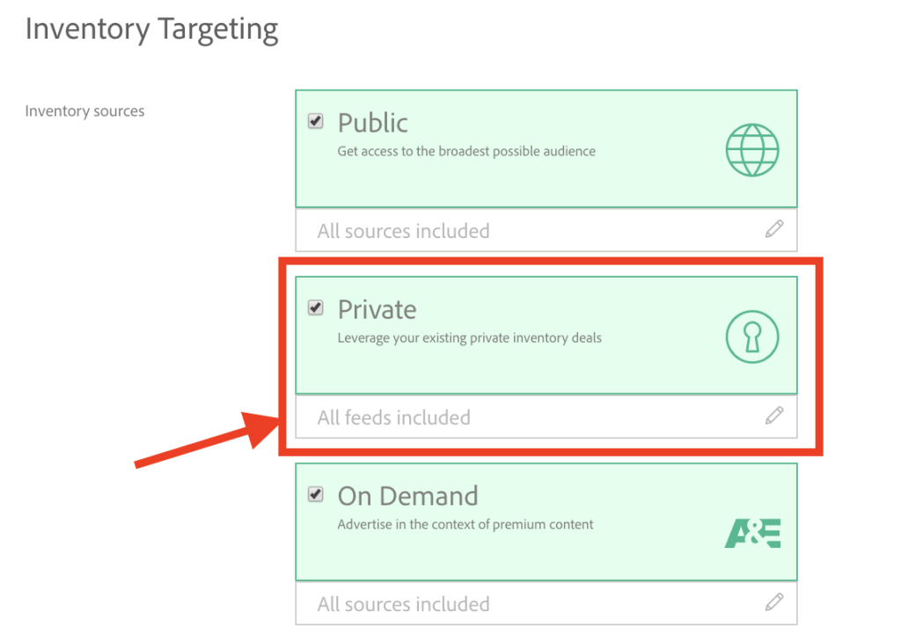

# Deal IDs {#deal-ids}

A Deal ID is a unique string of numbers that is shared between the buyer (advertiser) and the seller (publisher) to identify a specific deal that has been brokered between the two partners. A Deal ID can be as robust as an IO and&nbsp;includes all the agreed upon criteria (pricing, type of units, audience targeting, etc). Using a Deal ID is not the only way to setup a private deal within our DSP, but it does simplify the process and minimize errors by implementing a code vs traditional tags. To input a DSP into the Advertising Cloud platform, you have 2 paths. The first is via automated Deal ID ingestion.

Automated Deal ID Ingestion is currently available for Rubicon and Google Ad Manager. To get started, reach out to your Account Rep to ensure that your account is mapped properly within each publisher/SSP.
For publishers that use `Rubicon`as their SSP, they are required to indicate a "buyer" on&nbsp;the deal. This buyer (advertiser) will map to an Advertising Cloud ID, for&nbsp;activation in our platform.
For publishers that are using `Google Ad Manager`,&nbsp;advertisers can use either Adobe's parent seat or their own seat to access inventory. Once the deal is confirmed, a "client" must be attached to the deal. For preferred deals or private auctions, the advertiser&nbsp;can attach&nbsp;the client to the deal.&nbsp; For those deals as well as Programmatic Guaranteed deals, the publisher can indicate the client.&nbsp; A "client" is just like a "buyer" in Rubicon's platform. After the client has been setup, work with your Adobe Advertising Cloud account manager to ensure the deal/client have been setup correctly.

Once the deals are setup in their respective SSPs. They are ready to be activated in the Advertising Cloud DSP.

Start by navigating to the Private Inventory page in the platform. Here you will see a banner at the top of the page with a message that you may have new deals awaiting review.
    
After clicking on the banner, you will be taken to the New Fees page. This page will show all new Deal ID deals you have negotiated with all the deal parameters already ingested. The deal list is automatically refreshed every hour. On this page, you can accept the deal and attach it to a placement or simply ignore the deal.

If you're ready to activate the deal, review the feed and all the associated details. In this step, you will be required to confirm the publisher and choose which advertisers in the account will have access to the feed. If any of the information is incorrect, please contact the publisher as all the information has been pre-populated based on what they've sent over. Once those changes have been made by the publisher, they will reflected in our platform as well.

After accepting the deal, the inventory will be available in the Private section of the placement editor for you to select.

Things to keep in mind:

* The following deals cannot be automatically ingested:

    * AdX packages
    * Deal IDs with multiple publishers or buyers
    * Deal IDs with multiple parts to the deal

        * Two different start and/or end dates (i.e. one date for one size, another date for another size)
        * Two different CPM's (i.e. one CPM for mid-roll and another CPM for pre-roll)
        * Two different deal types (i.e. fixed CPM for video and floor CPM for display)

&nbsp;
For all other Deal ID ingestion (manual ingestion), please use the [Smart Ad Serving](user-guide/planning/private-inventory/brandaccess.md) workflow. 